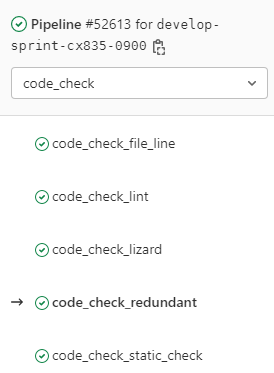
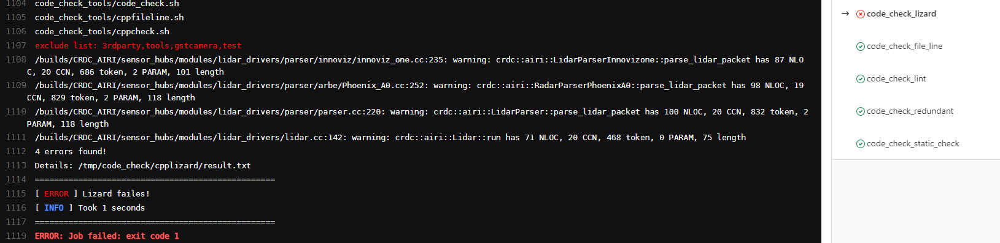
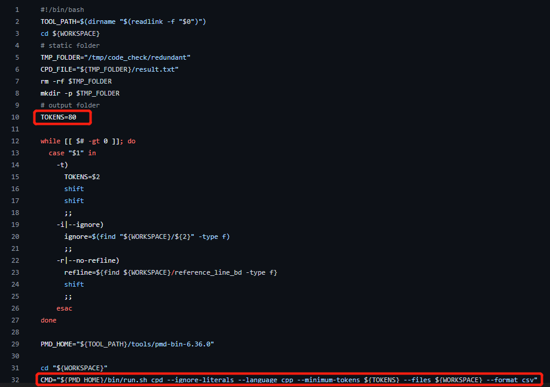

# Description

If you want to have good product quality or code quality upon project or product delivery, it is very necessary to use multiple inspection tools to monitor the code in each submission.
For example, [cppcheck](http://cppcheck.net/) (for the C++ code static check), [cpplint]() (for the C++ code style check ), [lizard](https://github.com/terryyin/lizard) (for the code circle complexity check), redundant, etc.

This project gives a good practice about how to use these kind of tools to supervise your project. 
Ii will gives your some comments at certain part of the script.

And how to put it in your CI/CD pipeline.

# Tools include

* cppcheck - static check
* cpplint - code style check
* pylint - python code style check
* cpplizard - circle complexity check
* redundant - code redundant check
* fl - code file lines too large check

# How to use
1. `Mandatory ` Define the `WORKSPACE` by environment variable, for example `export WORKSPACE=<path>`.
2. `Optional` Define the `CODE_CHECK_EXCLUDE_LIST` exclude folder list if need, for excample `export CODE_CHECK_EXCLUDE_LIST=<folder1>,<folder2>,...`.
3. `code_check.sh help` will print the help list and gives you some guidance.

``` shell
Usage:
    ./code_check.sh [OPTION]

Options:
    lint: run the code style check
    check: run the code static check
    lizard: run the code cyclomatic complexity check
    redundant: run the code redundant check
    verison: show the version of the scripts
    fl: run the code file lines check
    run: run all the code check
    exclude: show the exclude file list
```

# Good Practice

1. It could add into gitlab ci as a single stage with multiple steps.
   

2. Gives a failure if meet lint errors.
   

3. Lizard errors could be catched.
   

4. Redundant could be calculated.
   

5. The image below shows how to add the tool to the gitlab-ci.
   


# Annexe

1. You could use the $LINT_FILTER to define your custom rules.  
   

2. Customized rules could be defined also by $CHECK_FILTER. $CHECK_EXCULUDE could define the files or folders exclude.
   

3. $CC_THRESHOLD defines the threshold of the circle complexities, you will get a failure if bigger.
   $LEN_THRESHOLD defines the threshold of the number of the tokens in one line.
   $NB_PARAM_THRESHOLD defines the threshold of the number of the parameters of one method.
   $ERROR_THRESHOLD if bigger than this, get a failure.
   $NB_THREAD set it to accelerate the execution. 
   
   
4. $TOKENS if there is more than $TOKENS number of a series of continous tokens same in two place of the project. Errors and its place will display.
   
